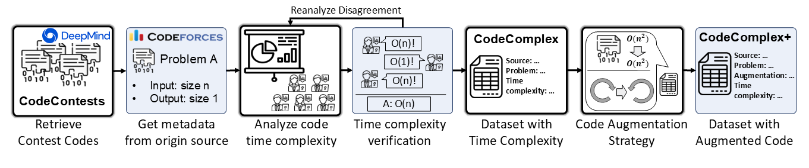
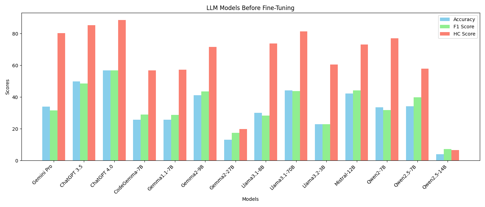
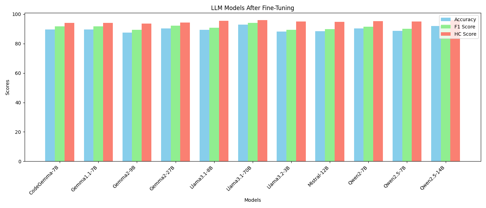

# CodeComplex: A Dataset for the Worst-Case Time Complexity Prediction
[**📊 Dataset**](https://github.com/sybaik1/CodeComplex/tree/main/data) | [**📖 Paper**](https://arxiv.org/abs/2401.08719)

## TL; DR

CodeComplex is a comprehensive dataset designed to evaluate models
in the complex task of predicting the worst-case time complexity for codes.
The dataset features **4,900 Java codes** and **4,900 Python codes**,
annotated with complexity labels across seven distinct classes.
It provides a robust benchmark for recognizing the reasoning capabilities
of LLMs in software development.

## About CodeComplex

CodeComplex is a dataset about the worst-case time complexities of codes.
The dataset is designed to evaluate the reasoning abilities
of Large Language Models in predicting the time complexity of code.
With a bilingual focus on Java and Python,
this dataset addresses gaps in previous benchmarks,
offering balanced complexity classes,
extensive annotation, and novel evaluation metrics.

CodeComplex leverages competitive programming submissions from Codeforces
and builds on the CodeContests dataset developed by DeepMind.
It extends the CoRCoD dataset by enhancing class distribution and introducing bilingual support.

### 🔍 Why CodeComplex?

1. **Fill the Gap**: Addresses limitations of existing benchmarks like CoRCoD and TASTY.
2. **Detailed Complexity Analysis**: Accounts for input representation and algorithmic structures.
3. **Open Source**: Fully accessible for research and development.
4. **Applications**: Useful for NLP, Software Engineering, and Programming Language communities.

### 📜 Features

- **Bilingual Dataset**: Includes both Java and Python codes from competitive programming platforms.
- **Seven Complexity Classes**: Annotated across constant ($`O(1)`$), linear ($`O(n)`$), quadratic ($`O(n^2)`$), cubic ($`O(n^3)`$), logarithmic ($`O(log n)`$), linear-logarithmic ($`O(n log n)`$), and exponential.
- **Balanced Class Distribution**: Designed to mitigate biases and enhance model generalization.
- **Comprehensive Annotations**: Labeled by expert annotators considering input characteristics, library impacts, and control structures.
- **Novel Evaluation Metric**: Introduces the Hierarchy Complexity Score (HC-Score) for nuanced performance assessment.

### 📊 Dataset Statistics

| Complexity Class | Java Codes | Python Codes |
|-------------------|------------|--------------|
| $O(1)$             | 750        | 791          |
| $O(n)$             | 779        | 853          |
| $O(n^2)$            | 765        | 657          |
| $O(n^3)$            | 601        | 606          |
| $O(log n)$         | 700        | 669          |
| $O(n log n)$       | 700        | 796          |
| Exponential      | 605        | 528          |
| Total            | 4,900       | 4,900         |

### Annotation Process


To ensure high quality and accurate labeling of the complexity classes,
the annotation process was conducted by a team of three experts with over five years of experience with programming and algorithm design.
Each annotator independently labeled the time complexity of the codes to avoid bias and improve reliability.

Problems were chosen based on their relevance to one of the seven predefined complexity classes.
Then correct code solutions that passed all test cases (including hidden ones) were considered.

> Incorrect or incomplete solutions were filtered out.

The solution codes were then annotated following the provided [guidelines](#annotator-guideline).

Cases of disagreement were resolved through discussions among the annotators.
Annotators shared their reasoning and reached a consensus.
After reaching a consensus, a final review of all annotations was conducted to ensure that
the dataset met high-quality standards.
Edge cases were revisited for thorough validation, and any ambiguities were resolved.

This meticulous process helped in building a reliable dataset
that accurately represents the time complexity of a diverse set of codes,
making it a valuable resource for evaluating LLMs.

### Hierarchy Complexity Score (HC-score)

When we analyzed the responses of LLMs, we noticed that part of the reasoning is correct
but then fails to combine them into a whole solution for the code.
To compensate for this issue, we brought up a new metric that hierarchically evaluates
How much of the predicted complexity deviates from the actual complexity?

HC-Score penalizes predictions based on their deviation from correct complexity classes.
It is calculated as follows:

$$HC-Score(P, R) = \frac{\sum_{i=1}^N \frac{|p_i - r_i|}{\text{Number of Classes}}}{N}$$

Here, $p_i$ represents predicted complexity classes, $r_i$ represents true complexity classes, and $N$ is the total number of predictions. The Windowed HC-Score expands this metric by allowing flexible evaluation within a defined margin of error:

$$HC-Score_w(P, R) = \frac{\sum_{i=1}^N max(1 - |p_i - r_i| / w, 0)} {N}$$

This nuanced approach factors in the partial reasoning capabilities of LLMs.

## 🏆 Leaderboard

### LLM models before any fine-tuning

| Model | Accuracy   | F1 Score  | HC Score  |
|-------|------------|-----------|-----------|
| Gemini Pro | 34.0 | 31.6 | 80.2 |
| ChatGPT 3.5 | 49.9 | 48.6 | 85.2 |
| ChatGPT 4.0 | 56.9 | 56.7 | 88.6 |
| CodeGemma-7B | 25.7 | 28.9 | 56.7 |
| Gemma1.1-7B | 25.7 | 28.7 | 57.3 |
| Gemma2-9B | 41.1 | 43.5 | 71.5 |
| Gemma2-27B | 13.2 | 17.5 | 19.8 |
| Llama3.1-8B | 30.0 | 28.4 | 73.8 |
| Llama3.1-70B | 44.2 | 43.8 | 81.3 |
| Llama3.2-3B | 22.9 | 22.8 | 60.6 |
| Mistral-12B | 42.3 | 44.3 | 73.2 |
| Qwen2-7B| 33.6 | 31.9 | 77.1 |
| Qwen2.5-7B | 34.2 | 39.9 | 57.8 |
| Qwen2.5-14B | 4.0 | 7.2 | 6.6 |

We have used the instruction-tuned models for the models.
We have given an output format and some LLM models output nothing if they fail
to refine their output. Due to this reason, some larger models such as Qwen2.5-14B
has low scores

### LLM models and ML models with fine-tuning

| Model | Accuracy   | F1 Score  | HC Score  |
|-------|------------|-----------|-----------|
| CodeGemma-7B | 89.5 | 91.6 | 94.0 |
| Gemma1.1-7B | 89.6 |91.6 | 94.0 |
| Gemma2-9B | 87.4 | 89.4 | 93.5 |
| Gemma2-27B | 90.2 | 92.2 | 94.3 |
| Llama3.1-8B| 89.4 | 90.7 | 95.4 |
| Llama3.1-70B| 92.9 | 94.1 | 96.0 |
| Llama3.2-3B| 88.2 | 89.4 | 94.9 |
| Mistral-12B| 88.5 | 89.7 | 94.8 |
| Qwen2-7B| 90.2 | 91.5 | 95.3 |
| Qwen2.5-7B| 88.7 | 90.0 | 95.0 |
| Qwen2.5-14B| 91.9 | 93.2 | 96.0 |
| CodeBERT(Java)     | - | 77.3 | 90.9 |
| GraphCodeBERT(Java)| - | 85.5 | 94.1 |
| UniXcoder(Java)    | - | 86.5 | 94.6 |
| PLBART(Java)       | - | 85.3 | 94.3 |
| CodeT5(Java)       | - | 82.4 | 93.1 |
| CodeT5+(Java)      | - | 85.8 | 94.6 |
| CodeBERT(Python)     | - | 73.3 | 88.7 |
| GraphCodeBERT(Python)| - | 80.8 | 92.2 |
| UniXcoder(Python)    | - | 85.4 | 94.0 |
| PLBART(Python)       | - | 77.2 | 91.0 |
| CodeT5(Python)       | - | 75.5 | 89.9 |
| CodeT5+(Python)      | - | 78.2 | 91.0 |

We fine-tuned the models with the CodeComplex dataset by dividing the dataset
into a 9 to 1 ratio for training and evaluation. The models were trained for
6 epochs. After the fine-tuning, the LLM models showed less error for each complexity class, 
which decreased the difference between F1 and HC scores.

Here are the scores in a histogram version



## Annotator Guideline

1. Instructions

Check the Variables Described in the Algorithm Problems

Each algorithm implementation can have many variable instances. Only consider the variables that are given as inputs from the problems for calculating the time complexity.

> ![Input Variable Notation]
> For convenience, use n and m to denote input variables and |n| and |m| to denote the size of n and m.

2. Time Complexity Calculation

Based on the input variables, follow the instructions below to calculate the time complexity:

a. Single Numeric Input

When only a number n is given as an input, calculate the time complexity proportional to n.

Do the same for multiple variables. For example, when only n is given as an input, the variable used to denote the time complexity of the code is n.

b. Multiple Numeric Inputs

When n and m numeric instances are given as inputs, calculate the time complexity proportional to the one with higher complexity.

For example, if m = n^2, compute the complexity of the code with m. If the implemented algorithm runs in O(n^2) = O(m), it belongs to the linear complexity class.

c. Constant Inputs

If the input is given as constant values, the complexity of the code belongs to the constant class.

For instance, if an algorithm problem states that exactly 3 numeric values are given as inputs, and the solution code only uses a constant number of operations, the code belongs to the constant complexity class.

3. Input Constraints

Consider cases where the code utilizes the input constraints of the problem. For example, if the input is given as n ≤ a, the code can use the fixed value a instead of n. Mark these codes as unsuitable.

4. Built-in Library Usage

Consider built-in libraries used in the algorithm (e.g., HashMap, sort, etc.) when calculating the time complexity of the entire code.

For instance, given n numeric instances as inputs, if an algorithm uses O(n) iterations of a built-in sort algorithm, the time complexity for the algorithm is O(n^2 ∗ log(n)).

5. Unreachable Code

When the code has unreachable sections, only consider the reachable code for time complexity analysis.

6. Mark Unsuitable Items

Mark items that do not belong to any of the 7 predefined complexity classes.


## 🛠 Getting Started

### Installation

Clone the repository:
```bash
git clone https://github.com/sybaik1/CodeComplex.git
```

## 🖊 Citation
```text
@misc{baik2024codecomplextimecomplexitydatasetbilingual,
      title={CodeComplex: A Time-Complexity Dataset for Bilingual Source Codes}, 
      author={Seung-Yeop Baik and Joonghyuk Hahn and Jungin Kim and Aditi and Mingi Jeon and Yo-Sub Han and Sang-Ki Ko},
      year={2024},
      eprint={2401.08719},
      archivePrefix={arXiv},
      primaryClass={cs.SE},
      url={https://arxiv.org/abs/2401.08719},
}
```
